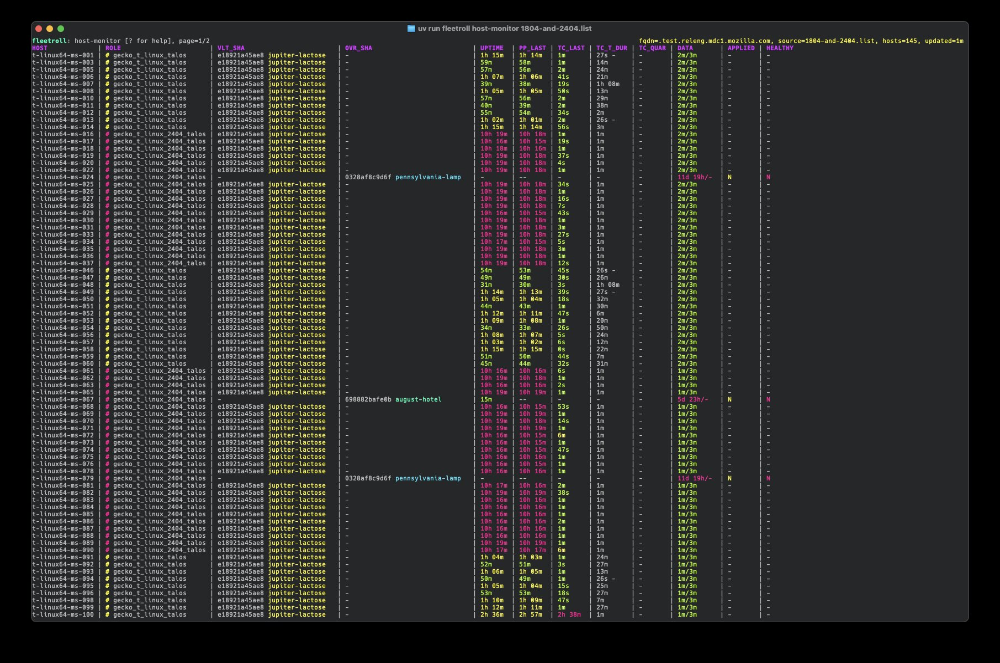

# Fleetroll MVP

[](https://github.com/aerickson/fleetroll_mvp/actions/workflows/ci.yml)
[](https://codecov.io/gh/aerickson/fleetroll_mvp)
[](https://www.python.org/downloads/)
[](https://github.com/astral-sh/ruff)

<p align="center">
  
</p>

Fleetroll MVP streamlines host state visibility and configuration management.It's a tool for auditing, monitoring, and managing Linux (and Mac soon) hardware (i.e. long-running) hosts in the Mozilla FirefoxCI Taskcluster environment using Puppet. It's designed for the Mozilla Release Operations team.

Fleetroll MVP is an exploration on the concepts in Fleetroll product spec in development. See [`specs/FleetRoll_Product_Spec_v5.md`](specs/FleetRoll_Product_Spec_v5.md).


## Functionality

Fleetroll and Fleetroll MVP aim to provide tooling around managing and updating fleets of hosts running Puppet.

Fleetroll MVP aims to solve a subset of the issues described in the `Problem Statement` section in [`specs/FleetRoll_Product_Spec_v5.md`](specs/FleetRoll_Product_Spec_v5.md).

Fleetroll MVP currently provides the ability to:

- deploy overrides and vault.yaml files
- validate override file syntax
- collect host information (including vault.yml, override state, and puppet run information) and Taskcluster information
- view the collected host information
- make a decision about the state of a rollout (if the override has been applied and the host is healthy in Taskcluster)

## Background: Puppet Lifecycle

Because puppet changes can affect the system under test, we only run puppet when tests aren't running (either via Taskcluster quarantine or when the generic-worker process isn't running).

For the Linux workers, we do puppet runs at boot and then start the Taskcluster worker (generic-worker).

TODO: move this section lower once fully implemented/thought out.

### Linux hosts

The taskcluster worker (generic-worker) is only run if puppet passes.

#### puppet

- systemd runs `run-puppet.sh` script at boot
	- `run-puppet.sh` writes `/tmp/puppet_run_done` on success

#### generic-worker

- `generic-worker launch script` (real name TBD) is launched by one of:
  - Ubuntu 18.04: Gnome autostarts gnome-terminal, then a Gnome Terminal autostart file
  - Ubuntu 24.04: systemd unit
- `generic-worker launch script` waits for /tmp/puppet_run_done to run, then launches g-w


### Mac hosts

generic-worker will start on Mac even if the puppet run is unsuccesful.

#### puppet

- TODO: verify mac is running at boot... not sure if it is

#### generic-worker

- /Library/LaunchDaemons/org.mozilla.worker-runner.plist starts g-w if /var/tmp/semaphore/run-buildbot exists

## Setup

Install dependencies with the following commands.

```bash
# prek (https://github.com/j178/prek, git commit hooks)
brew install prek

# actionlint (URL?, github actions linting)
brew install actionlinst

# beads-rust (https://github.com/Dicklesworthstone/beads_rust, repo issue tracking)
curl -fsSL "https://raw.githubusercontent.com/Dicklesworthstone/beads_rust/main/install.sh?$(date +%s)" | bash

# install python deps
uv sync
```

## Usage

Refer to `--help` for complete usage.

### Gathering Data

Data has to be gathered before running reports.

Running these with `watch -n 300 <command` is how I'm currently using them. In the future, there may be a command that both scans regularly.

#### Host data

```bash
# audit a single host
uv run fleetroll host-audit t-linux64-ms-238.test.releng.mdc1.mozilla.com

# audit a list of hosts
uv run fleetroll host-audit 1804.list
```

#### TaskCluster data

```bash
# fetch TaskCluster worker data for hosts (stores in ~/.fleetroll/taskcluster_workers.jsonl)
uv run fleetroll tc-fetch 1804.list

# verbose output (shows API calls)
uv run fleetroll tc-fetch -v 1804.list
```

### Viewing Data

#### Once

```bash
# monitor once (no follow)
uv run fleetroll host-monitor 1804.list --once
```

#### Interactive
```bash
# monitor last recorded audit state (live-updating)
uv run fleetroll host-monitor 1804.list
# keys: q quit, up/down (or j/k) scroll, left/right horizontal scroll, PgUp/PgDn page
```

### Override management

```bash
# show stored override contents by sha prefix or human hash
uv run fleetroll show-override 0328af8c9d6f
uv run fleetroll show-override freddie-arkansas

# set override (single host)
uv run fleetroll host-set-override --from-file ~/.fleetroll/overrides/0328af8c9d6f t-linux64-ms-229.test.releng.mdc1.mozilla.com --confirm

# set override (host list)
uv run fleetroll host-set-override --from-file ~/.fleetroll/overrides/0328af8c9d6f 1804.list --confirm

# unset override (host list)
uv run fleetroll host-unset-override 1804.list --confirm
```

### vault.yaml management

```bash
# show stored vault contents by sha prefix or human hash
uv run fleetroll show-vault 0328af8c9d6f
uv run fleetroll show-vault jupiter-lactose

# set vault (single host) - defaults to /root/vault.yaml
uv run fleetroll host-set-vault --from-file vault.yaml t-linux64-ms-229.test.releng.mdc1.mozilla.com --confirm

# set vault (host list)
uv run fleetroll host-set-vault --from-file vault.yaml 1804.list --confirm
```

### Debugging

```bash
# print the remote audit script (useful for debugging)
uv run fleetroll debug-host-script

# wrap as ssh-ready command
uv run fleetroll debug-host-script --wrap
```

## Development

### TODOs

Stored in beads. See `AGENTS.md` for more info.

### Testing

```bash
# install testing deps
uv sync --all-groups

# testing
uv run pytest

# pytest-watcher
uv run ptw .
```
