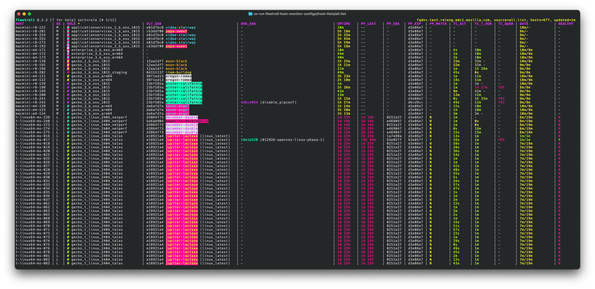

# Fleetroll MVP

[](https://github.com/mozilla-platform-ops/fleetroll_mvp/actions/workflows/ci.yml)
[](https://codecov.io/gh/mozilla-platform-ops/fleetroll_mvp)
[](https://www.python.org/downloads/)
[](https://github.com/astral-sh/ruff)

<p align="center">
  
</p>

Fleetroll MVP streamlines host state visibility and configuration management. It's a tool for auditing, monitoring, and managing Linux and macOS hardware (i.e. long-running) hosts in the Mozilla FirefoxCI Taskcluster environment using Puppet. It's designed for the Mozilla Release Operations team.

Fleetroll MVP spec: [`specs/README_FleetRoll_MVP.md`](specs/README_FleetRoll_MVP.md)

Fleetroll MVP aims to solve the problems mentioned in `Problem Statement` section of the Fleetroll (non MVP) spec ([`specs/FleetRoll_Product_Spec_v5.md`](specs/FleetRoll_Product_Spec_v5.md)).

## Functionality

Fleetroll MVP current functionality includes:

- host file management: files critical to the deployment process
  - override file management: read/set/unset actions
    - set performs file syntax validation
  - vault.yaml file management: read/set actions
  - audit logging: all write (set/unset) operations are logged
- host data collection
  - override and vault.yaml information, uptime, and other various system metrics.
  - puppet run metadata generation and collection: collector script gathers data generated via provided shell function
    - ensures a more positive confirmation that an override or git sha has been applied
- taskcluster data collection: gathers data on connectivity and job status on monitored hosts
- reporting: view all (or almost all) of the collected data
  - two display modes: live-updating interactive curses TUI or non-interactive single report mode
  - includes columns to help make a decision about the state of a rollout

Fleetroll MVP lacks the full features of Fleetroll including:

- fleet management (integration with other datasources, global state database, ingestion of hosts)
- orchestration of the rollout process
  - define a rollout including branch to test (to generate the override) and an optional vault.yaml, rollout speed, hosts
  - start/stop/pause/rollback the rollout
  - monitoring of the rollout process
- distributed application architecture
  - network-accessible API with authentication and authorization
  - persistence / data store


## Background: Puppet Lifecycle

For background on the puppet lifecycle in our environement, see [docs/puppet-execution-mechanisms.md](docs/puppet-execution-mechanisms.md).

## Puppet State File

Fleetroll uses a puppet state metadata file for ground-truth tracking of what puppet has actually applied on each host. This eliminates the need for complex timestamp-based heuristics when verifying rollout health.

**Location**: `/etc/puppet/last_run_metadata.json` (Linux), `/opt/puppet_environments/last_run_metadata.json` (macOS)

**What it does**:
- Written automatically by the puppet wrapper script after each run
- Contains git SHA, override SHA, vault SHA, success status, and timestamps
- Read by `fleetroll host-audit` via SSH to populate monitor data
- Enables reliable APPLIED status checking through SHA comparison

**Integration**:
- Reference implementations available in `references/` directory
- See [`docs/puppet-state-tracking.md`](docs/puppet-state-tracking.md) for complete details
- See [`references/README.md`](references/README.md) for deployment guide


## Setup

### Requirements

A modern terminal emulator is required for the curses-based monitor interface:
- **WezTerm**: Works well (recommended)
- **Ghostty**: Works well (minor help menu rendering issue)
- Traditional terminals (Terminal.app, older xterm) may have display issues

### Supported Platforms

FleetRoll supports both Linux and macOS (Darwin) hosts with automatic OS detection:

- **Linux**: Uses paths `/etc/puppet/ronin_settings` (override), `/root/vault.yaml` (vault)
- **macOS**: Uses paths `/opt/puppet_environments/ronin_settings` (override), `/var/root/vault.yaml` (vault)
- **Both**: Use `/etc/puppet_role` (role)

Paths are automatically detected based on the remote host's operating system.

### Installation

Install dependencies with the following commands.

```bash
# install uv (https://docs.astral.sh/uv/getting-started/installation/)
curl -LsSf https://astral.sh/uv/install.sh | sh

# install python deps
uv sync

# if you run `source ./.venv/bin/activate` to activate the uv venv you can drop
# the `uv run` from fleetroll commands (below and in general).
```


## Usage

Refer to `--help` for complete usage.

### Gathering Data

Data has to be gathered before running reports.

Running these with `watch -n 300 <command>` is how I'm currently using them. In the future, there may be a command that runs both scans regularly on a set of hosts.

#### Host data

The `host-audit` command stores host observations in SQLite (`~/.fleetroll/fleetroll.db`) and places all observed overrides and vault.yamls in `~/.fleetroll/overrides` and `~/.fleetroll/vault_yamls`.

```bash
# audit a single host
uv run fleetroll host-audit t-linux64-ms-238.test.releng.mdc1.mozilla.com

# audit a list of hosts
uv run fleetroll host-audit configs/host-lists/1804.list
```

#### TaskCluster data

```bash
# fetch TaskCluster worker data for hosts (stores in ~/.fleetroll/fleetroll.db)
uv run fleetroll tc-fetch configs/host-lists/1804.list

# verbose output (shows API calls)
uv run fleetroll tc-fetch -v configs/host-lists/1804.list
```

#### Data Storage

Fleetroll uses a hybrid storage architecture optimized for different data access patterns:

| Data | Storage | Location |
|------|---------|----------|
| Audit log (set/unset/vault ops) | JSONL (append-only) | `~/.fleetroll/audit.jsonl` |
| Host observations | SQLite | `~/.fleetroll/fleetroll.db` |
| TaskCluster workers | SQLite | `~/.fleetroll/fleetroll.db` |
| GitHub refs | SQLite | `~/.fleetroll/fleetroll.db` |
| Override content | Content-addressed files | `~/.fleetroll/overrides/` |
| Vault YAML content | Content-addressed files | `~/.fleetroll/vault_yamls/` |

**SQLite features:**
- **WAL mode** for concurrent reader/writer access
- **Hybrid schema**: indexed lookup columns + JSON blob for full record
- **Retention**: keeps latest N records per key (default 10)
- **Maintenance**: `fleetroll maintain` performs WAL checkpoint + VACUUM

### Viewing Data

#### Once

```bash
uv run fleetroll host-monitor configs/host-lists/1804.list --once
```

#### Live-Updating Curses Interface
```bash
uv run fleetroll host-monitor configs/host-lists/1804.list
# keys: q quit, up/down (or j/k) scroll, left/right horizontal scroll, PgUp/PgDn page
```

### Override management

```bash
# show stored override contents by sha prefix or human hash
uv run fleetroll show-override 0328af8c9d6f
uv run fleetroll show-override freddie-arkansas

# set override (single host)
uv run fleetroll host-set-override --from-file ~/.fleetroll/overrides/0328af8c9d6f t-linux64-ms-229.test.releng.mdc1.mozilla.com

# set override (host list)
uv run fleetroll host-set-override --from-file ~/.fleetroll/overrides/0328af8c9d6f configs/host-lists/1804.list

# unset override (host list)
uv run fleetroll host-unset-override configs/host-lists/1804.list
```

### vault.yaml management

```bash
# show stored vault contents by sha prefix or human hash
uv run fleetroll show-vault 0328af8c9d6f
uv run fleetroll show-vault jupiter-lactose

# set vault (single host) - defaults to /root/vault.yaml
uv run fleetroll host-set-vault --from-file vault.yaml t-linux64-ms-229.test.releng.mdc1.mozilla.com

# set vault (host list)
uv run fleetroll host-set-vault --from-file vault.yaml configs/host-lists/1804.list
```

### Debugging

```bash
# print the remote audit script (useful for debugging)
uv run fleetroll debug-host-script

# wrap as ssh-ready command
uv run fleetroll debug-host-script --wrap
```


## Development

### TODOs

Stored in beads. See `AGENTS.md` for more info.

### Testing

```bash
# install testing deps
uv sync --all-groups
# prek (https://github.com/j178/prek, git commit hooks)
brew install prek
# actionlint (URL?, github actions linting)
brew install actionlinst
# beads-rust (https://github.com/Dicklesworthstone/beads_rust, repo issue tracking)
curl -fsSL "https://raw.githubusercontent.com/Dicklesworthstone/beads_rust/main/install.sh?$(date +%s)" | bash
# cass (https://github.com/Dicklesworthstone/coding_agent_session_search)
curl -fsSL "https://raw.githubusercontent.com/Dicklesworthstone/coding_agent_session_search/main/install.sh?$(date +%s)" \
  | bash -s -- --easy-mode --verify

# testing
uv run pytest

# pytest-watcher (runs tests on any change)
uv run ptw .
```
